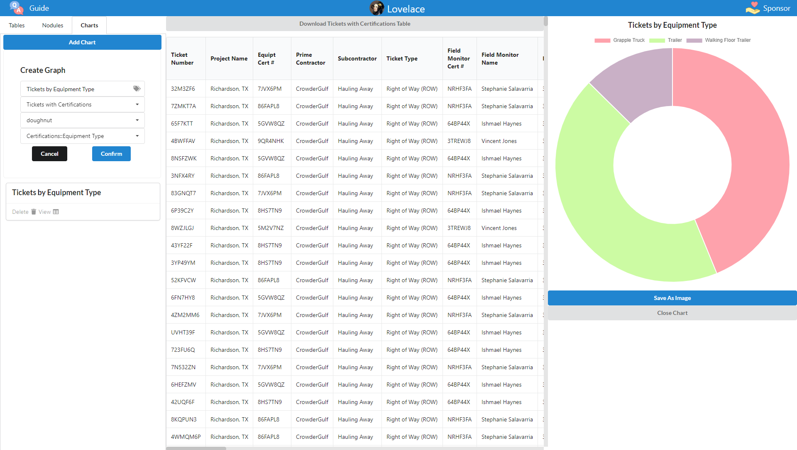

#  [dataLovelace.app](https://datalovelace.app)

[💛 Support this Project 💛](https://github.com/sponsors/joshuashoemaker/)

Lovelace is a simple to use web application that puts the power of data reporting into the hands of those who need it for free. It is a Free and Open Source Software (FOSS) project.

With Lovelace you can take all of your varying data sources, aggregate them to one place, and perform what ever kind of reports on them you need to either create beautiful chart representations, or robust tabular exports of your data.

### [Read the Documentation](https://docs.datalovelace.app)

or

### [Jump Right In](https://datalovelace.app) and play with the tool yourself